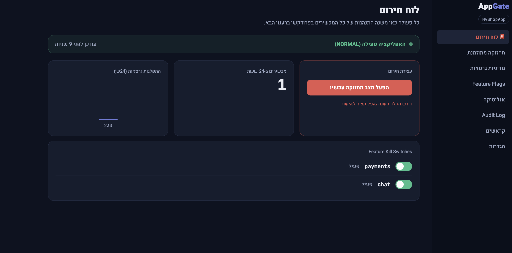
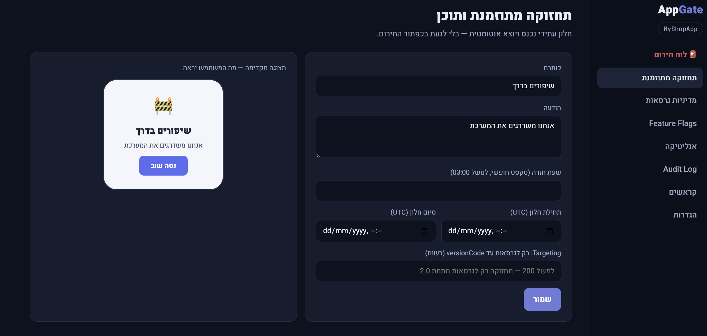
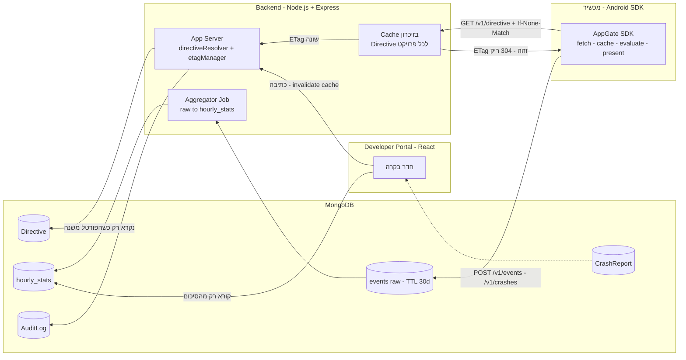
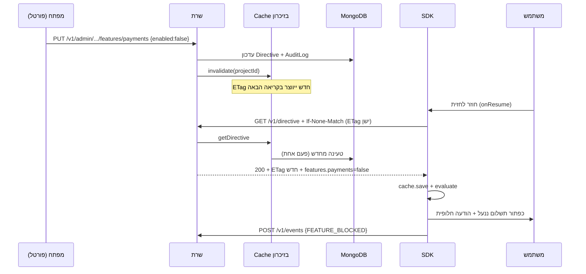
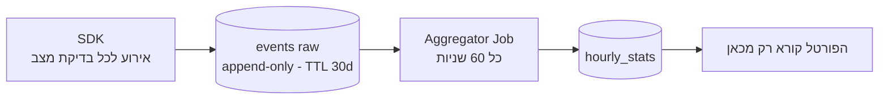
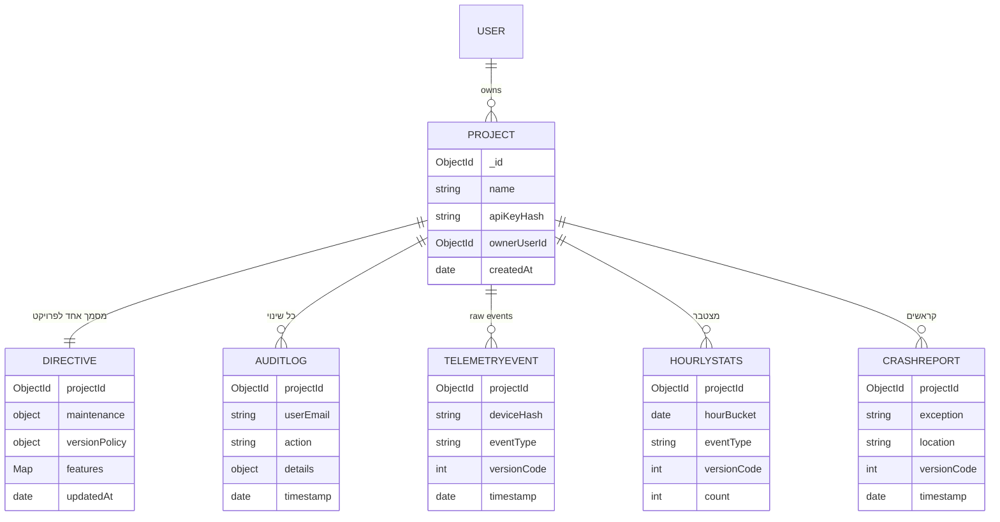

# AppGate SDK

> מצב תחזוקה, אכיפת גרסה ו-Kill Switch — שליטה מרחוק באפליקציית אנדרואיד שכבר נמצאת אצל המשתמשים.

מאת: ניר אברהם · פרויקט סמינריון

---

## תוכן עניינים

1. [מה זה ולמה](#מה-זה-ולמה)
2. [פיצ'רים](#פיצרים)
3. [צילומי מסך וסרטון](#צילומי-מסך-וסרטון)
4. [ארכיטקטורה](#ארכיטקטורה)
5. [מהלך חיים של פיצ'ר (Kill Switch)](#מהלך-חיים-של-פיצר)
6. [יעילות השרת](#יעילות-השרת)
7. [מסד הנתונים ו-ERD](#מסד-הנתונים-ו-erd)
8. [רשימת ה-Endpoints](#רשימת-ה-endpoints)
9. [Crash Sniffer — זיקוק קראשים](#crash-sniffer)
10. [התקנה והרצה](#התקנה-והרצה)
11. [הטמעה ב-SDK](#הטמעה-ב-sdk)
12. [תסריט דמו](#תסריט-דמו)

---

## מה זה ולמה

כל תיקון באפליקציית מובייל חייב לעבור קומפילציה, אישור של Google Play ועדכון מרצון של המשתמש — זמן תגובה לתקלה נמדד בימים. בינתיים באג בסליקה גובה תשלום כפול, מיגרציית DB מציגה שגיאות, וגרסאות ישנות שוברות את ה-API.

הבעיה ייחודית למובייל: ב-Web מחליפים קובץ בשרת, אבל במובייל **הקוד כבר "כלוא" אצל המשתמש**.

**AppGate** נותן "כפתור אדום": בכל פתיחה וחזרה לחזית, הספרייה שואלת את השרת "מה מצבי?" ומקבלת תשובת JSON אחת שקובעת מה יוצג — כלום, מסך תחזוקה, או דרישת עדכון. המפתח לוחץ בפורטל, השרת מעדכן הנחיה אחת + ETag חדש, והאפליקציה מגיבה ברענון הבא.

```
appgate/
├── server/        Node.js + Express + MongoDB — ה-API, cache בזיכרון, ETag/304, אגרגציה
├── portal/        React (Vite) — חדר הבקרה: לוח חירום, תזמון, גרסאות, flags, אנליטיקה, Audit, קראשים
└── sdk-android/   Kotlin — הספרייה (appgate) + אפליקציית דמו (demo-app = "MyShopApp")
```

---

## פיצ'רים

| פיצ'ר | תיאור |
|------|-------|
| **מצב תחזוקה** | הפעלה מיידית בלחיצה, או חלון מתוזמן (מ־/עד, UTC) שנכנס ויוצא אוטומטית. כותרת, הודעה ושעת חזרה מהפורטל. |
| **אכיפת גרסה מדורגת** | רכה (`SOFT_UPDATE`) — באנר שאפשר לסגור. חובה (`FORCE_UPDATE`) — דיאלוג חוסם + כפתור לחנות. |
| **Kill Switch לפיצ'רים** | כיבוי פיצ'ר בודד (תשלומים, צ'אט) בלי לפגוע בשאר האפליקציה, עם הודעה חלופית לכל פיצ'ר. |
| **Targeting לפי גרסה** | החלת הנחיה על טווח `versionCode` ("תחזוקה רק לגרסאות מתחת 2.0"). |
| **Fail-Safe / Fail-Open** | אין רשת? ממשיכים לפי ה-cache האחרון. אין גם cache? האפליקציה נשארת פתוחה. ה-SDK לעולם לא מפיל את אפליקציית הלקוח. |
| **Crash Sniffer** | תופס קריסות ושולח JSON קטן וקריא במקום stack trace ענק. |
| **אנליטיקה + Audit** | התפלגות גרסאות, כמה ראו תחזוקה, ולוג מלא של מי שינה מה ומתי. |

---
### צילומי מסך וסרטון

🎬 **סרטון דמו **
<video src="docs/demo.mp4" width="100%" controls></video>

🖼️ **לוח החירום בפורטל**


🖼️ **מסך תחזוקה באפליקציה**


## ארכיטקטורה

המערכת בנויה סביב עיקרון אחד: **שני נתיבים, שני דפוסי גישה, שני פתרונות.** נתיב הקריאה הוא Heavy-Read (הרבה בקשות, תשובה כמעט זהה), נתיב הכתיבה הוא Heavy-Write (הרבה טלמטריה).



**נקודת המפתח:** ההכרעה נעשית **פעמיים** — השרת מחשב את ההנחיה (`directiveResolver`), וה-SDK מאמת מקומית (גרסה, שעון) ב-`DirectiveEvaluator`. כך cache ישן לא חוסם בטעות ולא "בורח" מאכיפה.

---

## מהלך חיים של פיצ'ר

דוגמה: המפתח מכבה את פיצ'ר התשלומים (`payments`) דרך הפורטל. זהו המסלול המלא מהלחיצה ועד שהמשתמש רואה את ההודעה החלופית:



הקריאה ל-`isFeatureEnabled("payments")` עצמה **סינכרונית ומיידית** — היא עונה מה-cache המקומי ולא חוסמת את ה-UI. הרשת מתרחשת רק ברענון ברקע.

---

## יעילות השרת

זה הלב של הפרויקט. שלוש החלטות מרכזיות, כל אחת פותרת עומס אחר:

### 1. ETag + 304 — חיסכון ברוחב פס וסוללה

ההנחיה משתנה לעיתים נדירות. מכשיר ששולח `If-None-Match` עם ETag זהה מקבל **304 ריק** במקום אותו JSON שוב ושוב.

```
מכשיר  ->  If-None-Match: "a4f8"
שרת:   ETag נוכחי == "a4f8" ?  ->  304 Not Modified (גוף ריק, ~0 בייט)
```

המימוש כולו הוא **השוואת מחרוזת אחת** (`server/src/routes/public.js`). אלפי מכשירים שמבצעים polling לא מעבירים מטען מיותר.

### 2. Cache בזיכרון התהליך — ה-DB לא מרגיש את עומס הקריאה

מסמך `Directive` קטן (1–2KB) לכל פרויקט נטען לזיכרון התהליך (`server/src/services/cache.js`). הוא מתבטל (`invalidate`) רק כשהפורטל שומר שינוי. כך:

- רוב הקריאות נענות מהזיכרון, בלי לגעת ב-MongoDB.
- **בלי Redis ובלי רכיב נוסף** — פשטות מתאימה לעומס של מסמך אחד קטן.

### 3. raw to aggregate — טלמטריה בלי להציף את ה-DB



"כמה ראו תחזוקה לפי גרסה" על raw = סריקת **כל** האירועים בכל רענון. על הסיכום = עשרות שורות. כלומר **O(שעות) במקום O(אירועים)** (`server/src/services/aggregator.js`). אירועי raw נמחקים אוטומטית אחרי 30 יום (TTL index).

### מסלול שדרוג (לשאלות)

אותו עיקרון, בלי לשנות את ה-API: **CDN** לפני השרת לנתיב הקריאה, ו-**FCM Silent Push** לדחיפת שינוי מיידית במקום polling.

---

## מסד הנתונים ו-ERD

חמש ישויות עיקריות (+ CrashReport), **מופרדות לפי דפוס הגישה**: מה שנקרא הרבה מופרד ממה שנכתב הרבה.



**למה מסמך `Directive` אחד מאוחד?**

- קריאה אחת = כל מה שהמכשיר צריך.
- ETag אחד על המסמך — קל לבדוק "השתנה?".
- קטן (1–2KB) — מושלם ל-cache בזיכרון.

**הפרדה לפי דפוס גישה:**

- `Directive` — נקרא בכל פתיחה, נכתב נדיר. ← cache בזיכרון.
- `TelemetryEvent` — נכתב הרבה, append-only. ← TTL + אגרגציה.
- `HourlyStats` — הפורטל קורא רק מכאן. ← שאילתות קטנות ומהירות.
- `AuditLog` — נכתב פעם אחת ולא משתנה. ← אינדקס `(projectId, timestamp)`.

---

## רשימת ה-Endpoints

### Public (אימות ב-API Key, למכשירים)

| Method | Endpoint | תפקיד |
|--------|----------|-------|
| `GET`  | `/v1/directive?versionCode=&platform=&locale=` | הלב: מחזיר הנחיה. תומך ETag/304. |
| `POST` | `/v1/events` | קליטת אירוע טלמטריה (אחד לכל בדיקת מצב). |
| `POST` | `/v1/crashes` | קליטת תקציר קראש מה-Crash Sniffer. |

### Admin (אימות ב-JWT, לפורטל)

| Method | Endpoint | תפקיד |
|--------|----------|-------|
| `POST` | `/v1/admin/auth/login` | התחברות, מחזיר JWT. |
| `GET`  | `/v1/admin/projects` | רשימת פרויקטים. |
| `POST` | `/v1/admin/projects` | יצירת פרויקט + API Key (מוצג פעם אחת). |
| `GET`  | `/v1/admin/projects/:id/state` | מצב מלא + סטטוס חי. |
| `POST` | `/v1/admin/projects/:id/maintenance` | הפעלה/תזמון תחזוקה ← invalidate cache. |
| `PUT`  | `/v1/admin/projects/:id/version-policy` | עדכון minVersion / softMin. |
| `PUT`  | `/v1/admin/projects/:id/features/:key` | הדלקה/כיבוי פיצ'ר + הודעה. |
| `DELETE`| `/v1/admin/projects/:id/features/:key` | מחיקת פיצ'ר. |
| `GET`  | `/v1/admin/projects/:id/analytics` | נתונים מצטברים (מ-hourly_stats בלבד). |
| `GET`  | `/v1/admin/projects/:id/audit-log?page=` | היסטוריית שינויים, עם עימוד. |
| `GET`  | `/v1/admin/projects/:id/crashes?page=` | פיד הקראשים, עם עימוד. |

### דוגמת תשובה — `GET /v1/directive`

```json
{
  "status": "MAINTENANCE",
  "etag": "a4f8",
  "maintenance": {
    "title": "שיפורים בדרך",
    "message": "אנחנו משדרגים את המערכת",
    "returnAt": "03:00",
    "endsAt": "2026-06-10T01:00Z"
  },
  "versionPolicy": { "min": 210, "soft": 230, "url": "https://play.google.com/..." },
  "features": { "payments": { "enabled": false, "msg": "התשלומים יחזרו בקרוב" } }
}
```

---

## Crash Sniffer

הבעיה: כשאפליקציה קורסת, המפתח מקבל stack trace ענק ומבלבל. למשל הקריסה שראינו בפיתוח:

```
java.lang.NullPointerException: Attempt to invoke virtual method
'void android.widget.Button.setText(java.lang.CharSequence)' on a null object reference
    at dev.appgate.demo.MainActivity.buildProductCards$lambda$12$lambda$11$lambda$10(MainActivity.kt:144)
    at dev.appgate.demo.MainActivity.$r8$lambda$lNmG_fS0s8-oquwkcCsHAtqVN7c(MainActivity.kt:0)
    ... (עוד 14 שורות מערכת)
```

ה-`CrashReporter` (`appgate/src/main/java/dev/appgate/sdk/internal/CrashReporter.kt`) מתקין `UncaughtExceptionHandler` שתופס את הקריסה, **מזקק** ממנה את העיקר ושולח JSON קטן:

```json
{
  "exception": "NullPointerException",
  "message": "Attempt to invoke 'void Button.setText(...)' on a null object reference",
  "location": "MainActivity.buildProductCards:144",
  "versionCode": 230,
  "sdkInt": 34,
  "device": "Google sdk_gphone64_arm64",
  "timestamp": 1781193038105
}
```

הזיקוק מוצא את **הסיבה השורשית** (ה-`cause` הכי עמוק) ואת **המסגרת הראשונה בתוך קוד האפליקציה** (השורה שבאמת נשברה), במקום שורות מערכת לא רלוונטיות. בפורטל, מסך "קראשים" מציג שורה קריאה אחת לכל קריסה.

**עקרונות חשובים:**

- הקראש נשמר ל-disk **מיד** (`commit()`) כי התהליך עומד למות; נשלח בהפעלה הבאה.
- אנחנו **לא בולעים** את הקריסה — הקריאה ל-handler המקורי נשמרת, האפליקציה קורסת רגיל. אנחנו רק צופים.

> **הערה:** הקריסה שראינו בפיתוח (`btn_pay` null ב-`buildProductCards`) כבר תוקנה בקוד (הוספת `?` לקריאות `findViewById`). ה-Crash Sniffer הוא רשת ביטחון לקריסות **עתידיות** שלא צפינו.

לבדיקה ידנית אפשר לזרוק קריסה מכוונת: `throw RuntimeException("test crash")` — ולראות אותה מופיעה במסך הקראשים בפורטל אחרי הפעלה מחדש.

---

## התקנה והרצה

דרישות: Node.js 20+, Android Studio (Gradle 8.4, JDK 17).

### 1. שרת (VS Code, טרמינל ראשון)

```bash
cd server
npm install
cp .env.example .env      # לדמו: שנה ל-MEMORY_DB=true (MongoDB בזיכרון, ללא התקנה)
npm start
```

מדפיס:
```
Portal login : admin@appgate.dev / admin123
Demo API key : ag_live_demo_key_12345
[server] AppGate listening on :4000
```

> אם מקבלים `EADDRINUSE: port 4000` — כבר רץ שרת. במק: `lsof -ti:4000 | xargs kill -9`.

### 2. פורטל (VS Code, טרמינל שני)

```bash
cd portal
npm install
npm run dev          # http://localhost:5173 (proxy ל-/v1 ל-:4000)
```

### 3. מילוי נתונים לאנליטיקה (אופציונלי, בלי אמולטור)

```bash
cd server
node scripts/simulate-devices.js 300
```

### 4. SDK + אפליקציית דמו (Android Studio)

פתח את התיקייה **`sdk-android`** (לא `demo-app` לבד! היא מודול שתלוי ב-`appgate`). תן ל-Gradle Sync לרוץ עד הסוף — אז `demo-app` יופיע בבורר הקונפיגורציה והכפתור הירוק יידלק. הדמו מצביע על `http://10.0.2.2:4000` (= המחשב מתוך האמולטור).

---

## הטמעה ב-SDK

שתי רמות שימוש: מצב אוטומטי בשורה אחת למתחילים, listeners למתקדמים.

```kotlin
// Application.onCreate()
AppGate.init(this, "ag_live_demo_key_12345", baseUrl = "http://10.0.2.2:4000")

// MainActivity — auto mode (ה-SDK מציג לבד תחזוקה/עדכון)
AppGate.attachTo(this) { status -> /* עדכון UI משלך, אופציונלי */ }

// לפני פעולה רגישה — בדיקה מיידית מה-cache, ללא רשת
if (AppGate.isFeatureEnabled("payments")) {
    openPaymentScreen()
} else {
    showMsg(AppGate.getFeatureMessage("payments"))
}
```

### API ציבורי

| פונקציה | תיאור |
|---------|-------|
| `init(context, apiKey, baseUrl)` | אתחול ב-Application: טוען cache, מתזמן רענון, מתקין crash sniffer. |
| `checkStatus(callback)` | בדיקה מול השרת; מחזיר NORMAL / MAINTENANCE / FORCE_UPDATE / SOFT_UPDATE. |
| `attachTo(activity, onStatus?)` | מצב אוטומטי — ה-SDK מציג מסך תחזוקה / דיאלוג עדכון לבד. |
| `isFeatureEnabled(key)` | בדיקת Kill Switch — תשובה מיידית מה-cache. |
| `getFeatureMessage(key)` | ההודעה החלופית כשהפיצ'ר כבוי. |
| `setListener(GateListener)` | callbacks ל-UI מותאם. |
| `setCustomScreen(layout)` | החלפת מסך התחזוקה המובנה בעיצוב של המפתח. |

---

## תסריט דמו

1. שרת + פורטל רצים, האפליקציה פתוחה באמולטור, מחוברת ל-MyShopApp.
2. מוסיפים מוצרים לסל, לוחצים "לתשלום" — **עובד**.
3. בפורטל ← Feature Flags ← מכבים `payments`. חוזרים לאפליקציה (onResume מרענן) ← כפתור התשלום ננעל + הודעה חלופית. **(Kill Switch)**
4. בפורטל ← לוח חירום ← "הפעל מצב תחזוקה" + הקלדת `MyShopApp` ← חזרה לאפליקציה ← **מסך תחזוקה מלא**. סיום תחזוקה ← "נסה שוב" ← חוזרת לפעילות.
5. בפורטל ← מדיניות גרסאות ← `minVersion=300` ← חזרה לאפליקציה ← **דיאלוג עדכון חוסם** (versionCode=230 < 300).
6. הרצת `simulate-devices.js` ← **אנליטיקה** מתמלאת. מסך **Audit Log** מראה כל שינוי. מסך **קראשים** מראה תקצירים אם הייתה קריסה.
